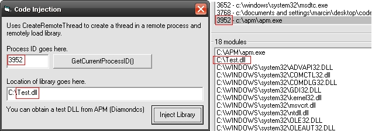



## Inject Library using CreateRemoteThread\(\)

### Description

This code is able to inject any DLL into a remote process, or even itself. This should be used only if you know what your doing. It was ported from a C++ application which i edited, i believe it was Felix's from http://win32.mvps.org/. Anyway, this code is a bit old as it is, there are probably some examples around anyway. Please vote =]
 
### More Info
 

             |
---                |---
**Submitted On**   |2006-12-07 17:13:18
**By**             |[Marcin Kleczynski](https://github.com/Planet-Source-Code/PSCIndex/blob/master/ByAuthor/marcin-kleczynski.md)
**Level**          |Advanced
**User Rating**    |4.3 (17 globes from 4 users)
**Compatibility**  |VB 6\.0
**Category**       |[Windows API Call/ Explanation](https://github.com/Planet-Source-Code/PSCIndex/blob/master/ByCategory/windows-api-call-explanation__1-39.md)
**World**          |[Visual Basic](https://github.com/Planet-Source-Code/PSCIndex/blob/master/ByWorld/visual-basic.md)
**Archive File**   |[Inject\_Lib2036221272006\.zip](https://github.com/Planet-Source-Code/marcin-kleczynski-inject-library-using-createremotethread__1-67319/archive/master.zip)

### API Declarations

CreateRemoteThread()

